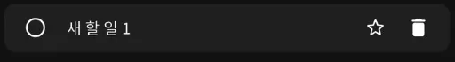

# tasks 앱 데이터 연동하기

## 상태관리, 데이터베이스 연결하기

* Freezed와 RiverPod을 이용하여 MVVM 패턴을 구현
* Firebase Firestore를 이용하여 데이터를 저장 및 활용
* GPS 와 Open API를 활용하여 위치에 따른 날씨 정보를 가져오는 기능 구현

### 필수기능

1. Firebase 프로젝트를 새로 만들고, 앱을 연결합니다. Firebase 콘솔에서 FireStore를 활성화합니다.
    1) DB의 보안 규칙을 true로 설정합니다.(default false인 상태에서는 저장소를 읽고 쓸 수 없어요!)
    ```dart
    service cloud.firestore {
        match /databases/{database}/documents {
            match /{document=**} {
                allow read, write: if true;
                }}}
    ```

2. MVVM 모델을 적용하여 패키지를 다시 구성해봅시다. 
    1. [Freezed](https://pub.dev/packages/freezed)를 사용하여 모델 클래스를 정의합니다(링크를 통해 공식 문서를 읽어보세요).
        - ToDoModel 예시
            ```dart
            part 'to_do_model.freezed.dart';
            part 'to_do_model.g.dart';
            @freezed
            abstract class ToDoModel with _$ToDoModel {
                const factory ToDoModel({
                    required String id,
                    required String title,
                    required String? description,
                    @JsonKey(name: 'is_favorite') required bool isFavorite,
                    @JsonKey(name: 'is_done') required bool isDone,
                }) = _ToDoModel;

                factory ToDoModel.fromJson(Map<String, Object?> json) =>
                    _$ToDoModelFromJson(json);
                    }
            ```
            
    2. List<ToDoModel>을 값으로 가지는 뷰모델(Riverpod 사용!)과 ToDo를 처리하는 Repository를 만들어봅시다. 
        1. [리버팟 공식 문서](https://riverpod.dev/ko/docs/introduction/getting_started)를 읽어보고 리버팟의 사용 방법에 대해서 익혀봅시다.
            1. 리버팟은 사용하는 방법이 크게 네 가지가 있습니다. 
            2. 해설 강의는 riverpod_generator + flutter_hooks로 진행될 예정입니다(실무에서 riverpod을 대부분 이렇게 사용합니다).
                - [riverpod_generator](https://pub.dev/packages/riverpod_generator) <= [pub.dev](http://pub.dev) 읽어보고 공부하기
                - [flutter_hooks](https://pub.dev/packages/flutter_hooks) <= [pub.dev](http://pub.dev) 읽어보고 공부하기
                
                - ToDoRepository 필수 구현 기능(다음 정의된 함수들을 그대로 구현하세요!)
                - 함수 내부 구현 시 다음 [공식 문서](https://firebase.google.com/docs/firestore/manage-data/add-data?hl=ko&_gl=1*eriopk*_up*MQ..*_ga*Njk1ODkzODY3LjE3NjE1NjU1Mzg.*_ga_CW55HF8NVT*czE3NjE1NjU1MzckbzEkZzAkdDE3NjE1NjU1MzckajYwJGwwJGgw)를 읽어보고 Firestore에 쓰고 읽을 수 있도록 구현하세요.
                ```dart
                abstract class ToDoRepository {
                    Future<void> addToDo(ToDoModel toDo);
                    Future<void> updateToDo(ToDoModel toDo);
                    Future<void> deleteToDo(String id);
                    Future<List<ToDoModel>> getToDos();
                    }
                ```
                ToDoViewModel 기능 정의(기존에 StatefulWidget에 작성했던 데이터 관련 기능을 모두 뷰모델로 내려줍니다.)
                ```dart
                @riverpod
                class HomePageViewModel extends _$HomePageViewModel {
                    final ToDoRepository toDoRepository = ToDoRepository();
                    @override
                    Future<List<ToDoModel>> build() async {…}
                    Future<void> addToDo({required ToDoModel toDo}) async {…}
                    Future<void> toggleFavorite({…}
                    Future<void> toggleDone({required String id, required bool isDone}) async {…}
                    Future<void> deleteTodo({required String id}) async {…}
                    }
                ```
                3. 기존에 작성했던 ToDo 추가, 즐겨찾기 설정, 완료 설정 관련된 뷰들과 뷰모델의 함수를 연결해줍니다.
                4. deleteToDo를 구현하기 위해 ToDoView에 휴지통 아이콘을 추가하고 뷰모델의 deleteTodo와 연결해주세요.
                    
